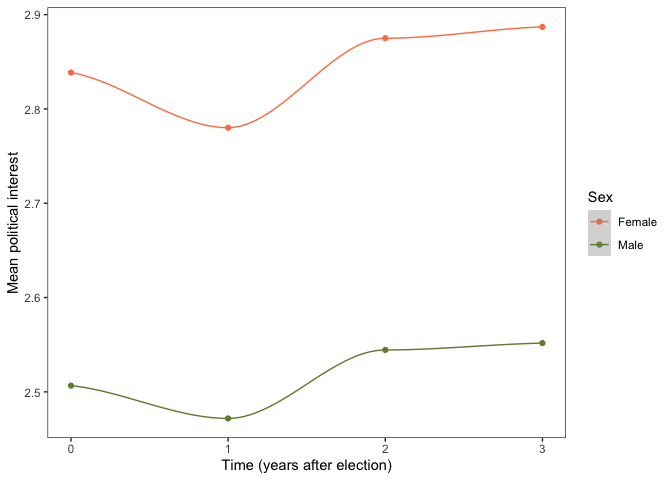
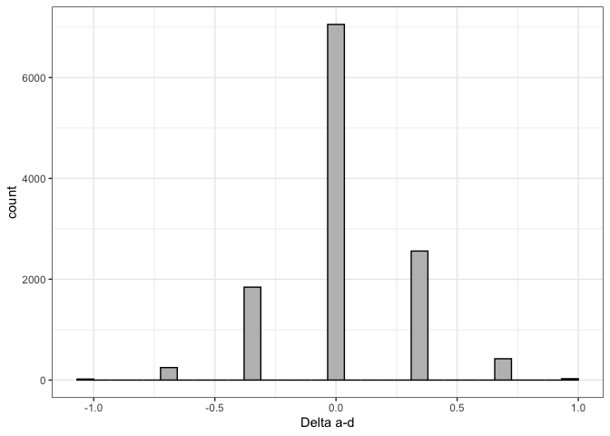
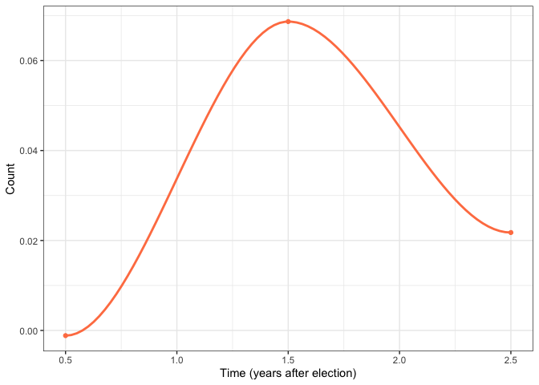
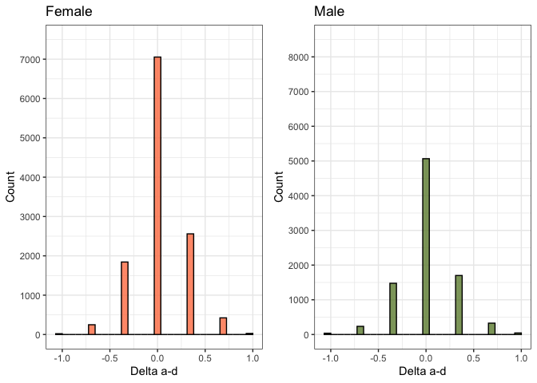
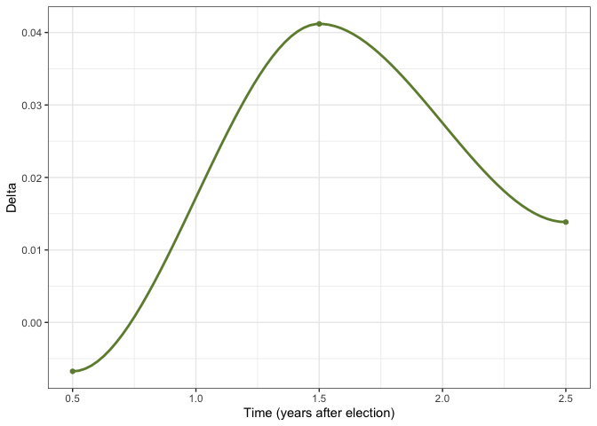
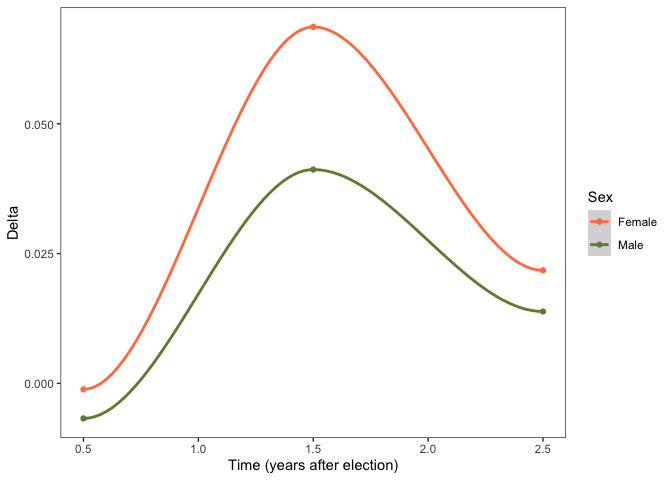

FInalproject
================
Emilia Korobowicz
31/07/2020

``` r
d_fun <- function(id, df) {
    tmp <- subset(df, pidp == id)
    res <- tmp[seq(2, nrow(tmp), 1), "vote6"] - tmp[seq(1, nrow(tmp)-1, 1), "vote6"]
    names(res) <- c("0_1", "1_2", "2_3")
    return(res)
}
```

Load libraries

``` r
library(tidyverse)
library(data.table)
library(ggplot2)
library(data.table)
library(tibble)
```

I will explore political interest (*vote6*) and how it changes over the
political cycle.I will try to combine population level analysis
(i.e. mean political interest) with individual level analysis. General
elections: 2010, 2015 and 2017 Wave 1 - 2009-2011 -\> Around
election-election (0) Wave 2 - 2010-2012 -\> After election (+1) Wave 3
- 2011-2013 -\> After election (+2) Wave 4- 2012-2014 -\> After election
(+3) Wave 5 - 2013-2015 -\> Around election (0) Wave 6 - 2015-2017 -\>
Around election (0) Wave 7 - 2017-2019 -\> After election (+1)

First I will read the data. I will want to read and join the data for
the first 7 waves of the Understanding Society. Wave 8 does not have a
variable for political interest). I will keep 5 variables: personal
identifier, sample origin, sex, age and political
interest.

``` r
files <- dir("/Users/emiliakorobowicz/Desktop/DataScience3/EmilysRepo/NewRepo/Data/UKDA-6614-tab/tab/",
             pattern = "indresp",
             recursive = TRUE,
             full.names = TRUE)

files <- files[stringr::str_detect(files, "ukhls")]
files
```

    ## [1] "/Users/emiliakorobowicz/Desktop/DataScience3/EmilysRepo/NewRepo/Data/UKDA-6614-tab/tab//ukhls_w1/a_indresp.tab"
    ## [2] "/Users/emiliakorobowicz/Desktop/DataScience3/EmilysRepo/NewRepo/Data/UKDA-6614-tab/tab//ukhls_w2/b_indresp.tab"
    ## [3] "/Users/emiliakorobowicz/Desktop/DataScience3/EmilysRepo/NewRepo/Data/UKDA-6614-tab/tab//ukhls_w3/c_indresp.tab"
    ## [4] "/Users/emiliakorobowicz/Desktop/DataScience3/EmilysRepo/NewRepo/Data/UKDA-6614-tab/tab//ukhls_w4/d_indresp.tab"
    ## [5] "/Users/emiliakorobowicz/Desktop/DataScience3/EmilysRepo/NewRepo/Data/UKDA-6614-tab/tab//ukhls_w5/e_indresp.tab"
    ## [6] "/Users/emiliakorobowicz/Desktop/DataScience3/EmilysRepo/NewRepo/Data/UKDA-6614-tab/tab//ukhls_w6/f_indresp.tab"
    ## [7] "/Users/emiliakorobowicz/Desktop/DataScience3/EmilysRepo/NewRepo/Data/UKDA-6614-tab/tab//ukhls_w7/g_indresp.tab"
    ## [8] "/Users/emiliakorobowicz/Desktop/DataScience3/EmilysRepo/NewRepo/Data/UKDA-6614-tab/tab//ukhls_w8/h_indresp.tab"
    ## [9] "/Users/emiliakorobowicz/Desktop/DataScience3/EmilysRepo/NewRepo/Data/UKDA-6614-tab/tab//ukhls_w9/i_indresp.tab"

``` r
vars <- c("memorig", "sex_dv", "age_dv", "vote6")

for (i in 1:7) {
        
        varsToSelect <- paste(letters[i], vars, sep = "_")
       
        varsToSelect <- c("pidp", varsToSelect)
      
        data <- fread(files[i], select = varsToSelect)
        if (i == 1) {
                all7 <- data  
        }
        else {
                all7 <- full_join(all7, data, by = "pidp")
        }
        
        rm(data)
} 
```

``` r
Long <- all7 %>% reshape(idvar = "pidp", direction = "long", 
                         v.names = c("memorig", "sex_dv", "age_dv", "vote6"),
                         times = letters[1:7],
                         varying = list(grep("memorig", names(all7), value = TRUE), 
                                        grep("sex_dv", names(all7), value = TRUE),
                                        grep("age_dv", names(all7), value = TRUE), 
                                        grep("vote6", names(all7), value = TRUE)))
```

Filter and recode. Now I will filter the data keeping only respondents
from the original UKHLS sample for Great Britain (memorig == 1). I also
want to clean the variables for sex (recoding it to “male” or “female”)
and political interest (keeping the values from 1). \#\# to 4 and coding
all negative values as missing)

``` r
Long <- Long %>% 
    filter(memorig == 1) %>%
    mutate(sex_dv = recode(sex_dv, "1" = "Male", "2" = "Female")) %>% 
    mutate(vote6 = ifelse(vote6 < 0, NA, vote6)) %>% 
    mutate(time_cycle = ifelse(time %in% c("a", "e", "f"), 0, 
                               ifelse(time %in% c("b", "g"), 1, 
                                      ifelse(time == "c", 2, 3
                                             )
                                      )
                               )
           )
```

    ## Warning: Unreplaced values treated as NA as .x is not compatible. Please specify
    ## replacements exhaustively or supply .default

Calculate mean political interest by sex, time and
time\_cycle

``` r
meanVote6 <- subset(Long, !is.na(sex_dv)) %>% group_by(sex_dv, time)  %>% summarise(mean = mean(na.omit(vote6)))
meanVote6
```

    ## # A tibble: 14 x 3
    ## # Groups:   sex_dv [2]
    ##    sex_dv time   mean
    ##    <chr>  <chr> <dbl>
    ##  1 Female a      2.84
    ##  2 Female b      2.82
    ##  3 Female c      2.87
    ##  4 Female d      2.89
    ##  5 Female e      2.87
    ##  6 Female f      2.81
    ##  7 Female g      2.73
    ##  8 Male   a      2.53
    ##  9 Male   b      2.51
    ## 10 Male   c      2.54
    ## 11 Male   d      2.55
    ## 12 Male   e      2.51
    ## 13 Male   f      2.47
    ## 14 Male   g      2.42

``` r
meanVote6_b <- subset(Long, !is.na(sex_dv)) %>% group_by(sex_dv, time_cycle)  %>% summarise(mean = mean(na.omit(vote6)))
meanVote6_b
```

    ## # A tibble: 8 x 3
    ## # Groups:   sex_dv [2]
    ##   sex_dv time_cycle  mean
    ##   <chr>       <dbl> <dbl>
    ## 1 Female          0  2.84
    ## 2 Female          1  2.78
    ## 3 Female          2  2.87
    ## 4 Female          3  2.89
    ## 5 Male            0  2.51
    ## 6 Male            1  2.47
    ## 7 Male            2  2.54
    ## 8 Male            3  2.55

First plot - MEAN political interest vs time\_cycle by gender. Notice
that here we are looking at changes in MEAN political interest, rather
than individual trends.

In this plot, we can see that the trends in female and in males are very
similar; although the mean political interest is persistently higher in
females than in males (~0.33 units).

The mean political interest progresively declines after the elections,
reaching a minimum about 1 year after the election. Then, there is a
rapid increase in political interest. Until second year after the
elections; afterwhich there still an increasing tren but it is a lot
more stable (there is a kind of
plateau).

``` r
ggplot(meanVote6_b, aes(time_cycle, mean, group = sex_dv, color = sex_dv)) + geom_point() +
    geom_smooth(size = 0.5) + theme_bw() + ylab("Mean political interest") + xlab("Time (years after election)") +
    scale_color_manual(values = c("coral", "darkolivegreen4")) +  labs(color = "Sex") + 
    theme(panel.grid.major = element_blank(), panel.grid.minor = element_blank())
```

    ## Warning in simpleLoess(y, x, w, span, degree = degree, parametric =
    ## parametric, : span too small. fewer data values than degrees of freedom.

    ## Warning in simpleLoess(y, x, w, span, degree = degree, parametric =
    ## parametric, : pseudoinverse used at -0.015

    ## Warning in simpleLoess(y, x, w, span, degree = degree, parametric =
    ## parametric, : neighborhood radius 2.015

    ## Warning in simpleLoess(y, x, w, span, degree = degree, parametric =
    ## parametric, : reciprocal condition number 0

    ## Warning in simpleLoess(y, x, w, span, degree = degree, parametric =
    ## parametric, : There are other near singularities as well. 4.0602

    ## Warning in predLoess(object$y, object$x, newx = if
    ## (is.null(newdata)) object$x else if (is.data.frame(newdata))
    ## as.matrix(model.frame(delete.response(terms(object)), : span too small. fewer
    ## data values than degrees of freedom.

    ## Warning in predLoess(object$y, object$x, newx = if
    ## (is.null(newdata)) object$x else if (is.data.frame(newdata))
    ## as.matrix(model.frame(delete.response(terms(object)), : pseudoinverse used at
    ## -0.015

    ## Warning in predLoess(object$y, object$x, newx = if
    ## (is.null(newdata)) object$x else if (is.data.frame(newdata))
    ## as.matrix(model.frame(delete.response(terms(object)), : neighborhood radius
    ## 2.015

    ## Warning in predLoess(object$y, object$x, newx = if
    ## (is.null(newdata)) object$x else if (is.data.frame(newdata))
    ## as.matrix(model.frame(delete.response(terms(object)), : reciprocal condition
    ## number 0

    ## Warning in predLoess(object$y, object$x, newx = if
    ## (is.null(newdata)) object$x else if (is.data.frame(newdata))
    ## as.matrix(model.frame(delete.response(terms(object)), : There are other near
    ## singularities as well. 4.0602

    ## Warning in simpleLoess(y, x, w, span, degree = degree, parametric =
    ## parametric, : span too small. fewer data values than degrees of freedom.

    ## Warning in simpleLoess(y, x, w, span, degree = degree, parametric =
    ## parametric, : pseudoinverse used at -0.015

    ## Warning in simpleLoess(y, x, w, span, degree = degree, parametric =
    ## parametric, : neighborhood radius 2.015

    ## Warning in simpleLoess(y, x, w, span, degree = degree, parametric =
    ## parametric, : reciprocal condition number 0

    ## Warning in simpleLoess(y, x, w, span, degree = degree, parametric =
    ## parametric, : There are other near singularities as well. 4.0602

    ## Warning in predLoess(object$y, object$x, newx = if
    ## (is.null(newdata)) object$x else if (is.data.frame(newdata))
    ## as.matrix(model.frame(delete.response(terms(object)), : span too small. fewer
    ## data values than degrees of freedom.

    ## Warning in predLoess(object$y, object$x, newx = if
    ## (is.null(newdata)) object$x else if (is.data.frame(newdata))
    ## as.matrix(model.frame(delete.response(terms(object)), : pseudoinverse used at
    ## -0.015

    ## Warning in predLoess(object$y, object$x, newx = if
    ## (is.null(newdata)) object$x else if (is.data.frame(newdata))
    ## as.matrix(model.frame(delete.response(terms(object)), : neighborhood radius
    ## 2.015

    ## Warning in predLoess(object$y, object$x, newx = if
    ## (is.null(newdata)) object$x else if (is.data.frame(newdata))
    ## as.matrix(model.frame(delete.response(terms(object)), : reciprocal condition
    ## number 0

    ## Warning in predLoess(object$y, object$x, newx = if
    ## (is.null(newdata)) object$x else if (is.data.frame(newdata))
    ## as.matrix(model.frame(delete.response(terms(object)), : There are other near
    ## singularities as well. 4.0602

<!-- -->

I calculated the mean difference between males and females \[within
waves\].

``` r
meanVote6_b_reshaped <- as.data.frame(meanVote6_b) %>% reshape(idvar = "sex_dv", timevar = "time_cycle", direction = "wide")
meanVote6_b_reshaped[1, -1] - meanVote6_b_reshaped[2, -1] 
```

    ##      mean.0    mean.1    mean.2    mean.3
    ## 1 0.3319944 0.3082708 0.3305367 0.3353013

Estimate stability of political interest over the political cycle.

To simplify interpretation, I will consider only wave a-d (timepoints 0,
1, 2, 3), and will only keep only the respondents with non-missing
values for political interest in these 4 waves I will do this analysis
at the individual level, rather than taking the mean(vote6) of each wave
as we did beforehand.

``` r
tmp <- subset(Long, time %in% c("a", "b", "c", "d"))
respondents_NA <- tmp %>% group_by(pidp) %>% summarise(no_missing = sum(!is.na(vote6)))
keep_respondents <- subset(respondents_NA, no_missing == 4) ## complete observations
df <- subset(tmp, pidp %in% keep_respondents$pidp &
                   !is.na(sex_dv) & !is.na(age_dv))
n_participants_dropped <- length(unique(respondents_NA)$pidp)
n_participants_dropped # 48111 # these numbers should be mentioned in the report
```

    ## [1] 48111

``` r
n_participants_included <- length(unique(keep_respondents)$pidp) 
n_participants_included # 21060 # these numbers should be mentioned in the report
```

    ## [1] 21060

``` r
df <- arrange(df, time) # make sure df is sorted by time
```

## Calculate Delta by time\_cycle for each person

``` r
female_delta <-do.call(rbind, lapply(unique(subset(df, sex_dv == "Female")$pidp), d_fun, df))
female_delta <- as.data.frame(female_delta)
rownames(female_delta) <- unique(subset(df, sex_dv == "Female")$pidp)
male_delta <-do.call(rbind, lapply(unique(subset(df, sex_dv == "Male")$pidp), d_fun, df))
male_delta <- as.data.frame(male_delta)
rownames(male_delta) <- unique(subset(df, sex_dv == "Male")$pidp)
head(female_delta)
```

    ##          0_1 1_2 2_3
    ## 68006127   0   0   0
    ## 68006807   0   0   0
    ## 68007487   1   2  -3
    ## 68008847   1   1  -1
    ## 68010887   2   0  -2
    ## 68020407  -1   0   1

``` r
head(male_delta)
```

    ##          0_1 1_2 2_3
    ## 68004087   0   0  -1
    ## 68009527   1   0  -1
    ## 68035367  -1   1   0
    ## 68036727  -1   0   1
    ## 68041491   0   0   0
    ## 68042167   0   0   0

here 0\_1 is the change from wave a to wave b; 1\_2 change from wave b
to wave c; and 2\_3 change from wave c to wave d each row corresponds to
a participants, so basically female\_delta or male\_delta, show the
change in political interest of each individual along the political
cycle I will tabulate the change in political interest for each of the 3
intervals (0\_1), (1\_2), (2\_3)

1)  Analysis for
females

<!-- end list -->

``` r
fd_summary <- as.data.frame(do.call(rbind, lapply(female_delta, function(x) 100*(table(x)/nrow(female_delta)))))
fd_summary <- round(fd_summary, 2) 
fd_summary
```

    ##       -3   -2    -1     0     1    2    3
    ## 0_1 0.10 2.71 16.85 60.50 17.39 2.31 0.15
    ## 1_2 0.10 1.80 14.11 62.29 18.70 2.83 0.17
    ## 2_3 0.17 2.01 14.95 63.59 17.01 2.14 0.12

Each row of fd\_summary represents the interval between two consecutive
waves The rows indicate the absolute change in political interest (vote
6). Each cell indicates the percentage of participants that had a
specific change in vote 6 for a given time interval (0\_1, 1\_2, 1\_3).

Now I check the % of participants for which there was an increase in
political interest for each of the 3 time intervals.

``` r
rowSums(fd_summary[, 1:3])
```

    ##   0_1   1_2   2_3 
    ## 19.66 16.01 17.13

Now I check the % of participants for which there was a decrease in
political interest for each of the 3 time intervals

``` r
rowSums(fd_summary[, 5:7])
```

    ##   0_1   1_2   2_3 
    ## 19.85 21.70 19.27

Key messages for each interval: 0\_1 Overall

``` r
mean(female_delta[, 1])
```

    ## [1] -0.001149992

  - 60% of participants did not change their political interest
  - 19.8% of participants moved towards a higher value of vote6
  - 19.6% of participants moved towards a lower value of vote6 However,
    on average there was a decrease of political interest
    (mean(female\_delta\[, 1\])). An overall decline in potical interest
    indicates that although there were more participants that gain
    political interest compared to those that lost political interest;
    the individual drop in political interest was larger than the
    individual gain in political interest

1\_2 Overall

``` r
mean(female_delta[, 2])
```

    ## [1] 0.06867094

  - 62% of participants did not change their political interest
  - 21.7% of participants moved towards a higher value of vote6
  - 16.01% of participants moved towards a lower value of vote6 On
    average there was an increase of political interest
    mean(female\_delta\[, 2\])

2\_3 Overall

``` r
mean(female_delta[, 3])
```

    ## [1] 0.0217677

64% of participants did not change their political interest 19.2% of
participants moved towards a higher value of vote6 17.01% of
participants moved towards a lower value of vote6 In average there was
an increase of political interest mean(female\_delta\[, 3\])

Overall change
0\_3

``` r
table(rowSums(female_delta)/3)/nrow(female_delta) # 58% of participants did not change their political interest
```

    ## 
    ##                 -1 -0.666666666666667 -0.333333333333333                  0 
    ##        0.001642845        0.020371283        0.151388204        0.579431575 
    ##  0.333333333333333  0.666666666666667                  1 
    ##        0.210202070        0.034746180        0.002217841

``` r
sum((table(rowSums(female_delta)/3)/nrow(female_delta))[5:7]) # 24.71% moved to a higher value of vote6
```

    ## [1] 0.2471661

``` r
sum((table(rowSums(female_delta)/3)/nrow(female_delta))[1:3]) # 17.34 moved to a lowe level of vote6
```

    ## [1] 0.1734023

``` r
df_plot <-data.frame(delta = (rowSums(female_delta)/3))


ggplot(data = df_plot, aes(delta)) + geom_histogram(fill = "gray", color = "black") + theme_bw() + xlab("Delta a-d")
```

<!-- -->

This distribution is quite symmetric, but slightly shifted to the right.
This means that overall there is an increase in political interest
through the political cycle

Now I plot delta
trend

``` r
female_delta_2 <- data.frame(delta = colSums(female_delta)/nrow(female_delta), time = c(0.5,1.5,2.5))
female_delta_2$sex = "Female"

ggplot(female_delta_2, aes(x = time, y = delta)) + geom_point(color = "coral") + geom_smooth(color = "coral") + xlab("Time (years after election)") +
    ylab("Delta") + theme_bw() + ylab("Count")
```

    ## Warning in simpleLoess(y, x, w, span, degree = degree, parametric =
    ## parametric, : span too small. fewer data values than degrees of freedom.

    ## Warning in simpleLoess(y, x, w, span, degree = degree, parametric =
    ## parametric, : pseudoinverse used at 0.49

    ## Warning in simpleLoess(y, x, w, span, degree = degree, parametric =
    ## parametric, : neighborhood radius 1.01

    ## Warning in simpleLoess(y, x, w, span, degree = degree, parametric =
    ## parametric, : reciprocal condition number 0

    ## Warning in simpleLoess(y, x, w, span, degree = degree, parametric =
    ## parametric, : There are other near singularities as well. 1.0201

    ## Warning in predLoess(object$y, object$x, newx = if
    ## (is.null(newdata)) object$x else if (is.data.frame(newdata))
    ## as.matrix(model.frame(delete.response(terms(object)), : span too small. fewer
    ## data values than degrees of freedom.

    ## Warning in predLoess(object$y, object$x, newx = if
    ## (is.null(newdata)) object$x else if (is.data.frame(newdata))
    ## as.matrix(model.frame(delete.response(terms(object)), : pseudoinverse used at
    ## 0.49

    ## Warning in predLoess(object$y, object$x, newx = if
    ## (is.null(newdata)) object$x else if (is.data.frame(newdata))
    ## as.matrix(model.frame(delete.response(terms(object)), : neighborhood radius 1.01

    ## Warning in predLoess(object$y, object$x, newx = if
    ## (is.null(newdata)) object$x else if (is.data.frame(newdata))
    ## as.matrix(model.frame(delete.response(terms(object)), : reciprocal condition
    ## number 0

    ## Warning in predLoess(object$y, object$x, newx = if
    ## (is.null(newdata)) object$x else if (is.data.frame(newdata))
    ## as.matrix(model.frame(delete.response(terms(object)), : There are other near
    ## singularities as well. 1.0201

<!-- --> When we
compare the change in political interest between consecutive years
following an election, we can see that the largest change in politica
interest occurs between the first and the second year.

2)  Analysis for
males

<!-- end list -->

``` r
md_summary <- as.data.frame(do.call(rbind, lapply(male_delta, function(x) 100*(table(x)/nrow(male_delta)))))
md_summary <- round(md_summary, 2) 
md_summary
```

    ##       -3   -2    -1     0     1    2    3
    ## 0_1 0.29 2.70 17.11 60.51 16.35 2.76 0.28
    ## 1_2 0.23 2.15 15.42 60.84 18.51 2.54 0.30
    ## 2_3 0.27 2.14 16.05 62.05 16.74 2.49 0.27

Each row of fd\_summary represents the interval between two consecutive
waves. The rows indicate the absolute change in political interest (vote
6). Each cell indicates the percentage of participants that had a
specific change in vote 6 for a given time interval (0\_1, 1\_2, 1\_3)

Let’s now check the % of participants for which there was an increase in
political interest for each of the 3 time intervals

``` r
rowSums(md_summary[, 1:3])
```

    ##   0_1   1_2   2_3 
    ## 20.10 17.80 18.46

Let’s now check the % of participants for which there was a decrease in
political interest for each of the 3 time intervals

``` r
rowSums(md_summary[, 5:7])
```

    ##   0_1   1_2   2_3 
    ## 19.39 21.35 19.50

Key messages for each interval: 0\_1 overall

``` r
mean(male_delta[, 1])
```

    ## [1] -0.006752954

  - 60% of participants did not change their political interest
  - 19.4% of participants moved towards a higher value of vote6
  - 20.1% of participants moved towards a lower value of vote6 However,
    on average there was a decrease of political interest
    (mean(male\_delta\[, 1\]))

1\_2 overall

``` r
mean(male_delta[, 2])
```

    ## [1] 0.04119302

  - 61% of participants did not change their political interest
  - 17.7% of participants moved towards a higher value of vote6
  - 16.01% of participants moved towards a lower value of vote6 On
    average there was an increase of political interest
    mean(female\_delta\[, 2\])

2\_3 overall

``` r
mean(male_delta[, 3])
```

    ## [1] 0.01384356

  - 64% of participants did not change their political interest
  - 19.3% of participants moved towards a higher value of vote6
  - 17.1% of participants moved towards a lower value of vote6 On
    average there was an increase of political interest
    mean(male\_delta\[, 3\])

Overall change
0\_3

``` r
table(rowSums(male_delta)/3)/nrow(male_delta) # 57% of participants did not change their political interest
```

    ## 
    ##                 -1 -0.666666666666667 -0.333333333333333                  0 
    ##        0.004164322        0.026449071        0.166122679        0.570174451 
    ##  0.333333333333333  0.666666666666667                  1 
    ##        0.191333708        0.036803602        0.004952167

``` r
sum((table(rowSums(male_delta)/3)/nrow(male_delta))[5:7]) # 23.3% moved to a higher value of vote6
```

    ## [1] 0.2330895

``` r
sum((table(rowSums(male_delta)/3)/nrow(male_delta))[1:3]) # 19.7 moved to a lowe level of vote6
```

    ## [1] 0.1967361

``` r
dm_plot <-data.frame(delta = (rowSums(male_delta)/3))
ggplot(data = df_plot, aes(delta)) + geom_histogram(fill = "gray", color = "black") + theme_bw() + xlab("Delta a-d")
```

<!-- --> This
distribution is quite symmetric, but slightly shifted to the right. This
means that overall there is an increase in political interest through
the political cycle

At this stage I will compare the the delta distributions for the two
genders

``` r
library(cowplot)
m <- ggplot(data = dm_plot, aes(delta)) + geom_histogram(fill = "darkolivegreen4", color = "black", alpha = 0.8) +
    theme_bw() + xlab("Delta a-d") + ggtitle("Male") + ylab("Count") +
    scale_y_continuous(limits = c(0, 8500), breaks = seq(0, 10000, 1000))
f <- ggplot(data = df_plot, aes(delta)) + geom_histogram(fill = "coral", color = "black", alpha = 0.8) +
    theme_bw() + xlab("Delta a-d") + ggtitle("Female") + ylab('Count') +
    scale_y_continuous(limits = c(0, 7500), breaks = seq(0, 10000, 1000))
mf <- plot_grid(f, m, ncol = 2)
mf
```

<!-- -->

Plot delta
trend

``` r
male_delta_2 <- data.frame(delta = colSums(male_delta)/nrow(male_delta), time = c(0.5,1.5,2.5))
male_delta_2$sex = "Male"

ggplot(male_delta_2, aes(x = time, y = delta)) + geom_point(color = "darkolivegreen4") + geom_smooth(color = "darkolivegreen4") + xlab("Time (years after election)") +
    ylab("Delta") + theme_bw()
```

    ## Warning in simpleLoess(y, x, w, span, degree = degree, parametric =
    ## parametric, : span too small. fewer data values than degrees of freedom.

    ## Warning in simpleLoess(y, x, w, span, degree = degree, parametric =
    ## parametric, : pseudoinverse used at 0.49

    ## Warning in simpleLoess(y, x, w, span, degree = degree, parametric =
    ## parametric, : neighborhood radius 1.01

    ## Warning in simpleLoess(y, x, w, span, degree = degree, parametric =
    ## parametric, : reciprocal condition number 0

    ## Warning in simpleLoess(y, x, w, span, degree = degree, parametric =
    ## parametric, : There are other near singularities as well. 1.0201

    ## Warning in predLoess(object$y, object$x, newx = if
    ## (is.null(newdata)) object$x else if (is.data.frame(newdata))
    ## as.matrix(model.frame(delete.response(terms(object)), : span too small. fewer
    ## data values than degrees of freedom.

    ## Warning in predLoess(object$y, object$x, newx = if
    ## (is.null(newdata)) object$x else if (is.data.frame(newdata))
    ## as.matrix(model.frame(delete.response(terms(object)), : pseudoinverse used at
    ## 0.49

    ## Warning in predLoess(object$y, object$x, newx = if
    ## (is.null(newdata)) object$x else if (is.data.frame(newdata))
    ## as.matrix(model.frame(delete.response(terms(object)), : neighborhood radius 1.01

    ## Warning in predLoess(object$y, object$x, newx = if
    ## (is.null(newdata)) object$x else if (is.data.frame(newdata))
    ## as.matrix(model.frame(delete.response(terms(object)), : reciprocal condition
    ## number 0

    ## Warning in predLoess(object$y, object$x, newx = if
    ## (is.null(newdata)) object$x else if (is.data.frame(newdata))
    ## as.matrix(model.frame(delete.response(terms(object)), : There are other near
    ## singularities as well. 1.0201

<!-- --> When we
compare the change in political interest between consecutive years
following an election, we can see that the largest change in political
interest occurs between the first and the second year.

Plot delta trend combined for males and females

``` r
male_female_delta <- rbind(female_delta_2, male_delta_2)
ggplot(male_female_delta, aes(x = time, y = delta, color = sex)) + geom_point() + geom_smooth() + xlab("Time (years after election)") +
    ylab("Delta") + theme_bw() + scale_color_manual(values = c("coral", "darkolivegreen4")) +
    labs(color = "Sex") + theme(panel.grid.major = element_blank(), panel.grid.minor = element_blank())
```

    ## Warning in simpleLoess(y, x, w, span, degree = degree, parametric =
    ## parametric, : span too small. fewer data values than degrees of freedom.

    ## Warning in simpleLoess(y, x, w, span, degree = degree, parametric =
    ## parametric, : pseudoinverse used at 0.49

    ## Warning in simpleLoess(y, x, w, span, degree = degree, parametric =
    ## parametric, : neighborhood radius 1.01

    ## Warning in simpleLoess(y, x, w, span, degree = degree, parametric =
    ## parametric, : reciprocal condition number 0

    ## Warning in simpleLoess(y, x, w, span, degree = degree, parametric =
    ## parametric, : There are other near singularities as well. 1.0201

    ## Warning in predLoess(object$y, object$x, newx = if
    ## (is.null(newdata)) object$x else if (is.data.frame(newdata))
    ## as.matrix(model.frame(delete.response(terms(object)), : span too small. fewer
    ## data values than degrees of freedom.

    ## Warning in predLoess(object$y, object$x, newx = if
    ## (is.null(newdata)) object$x else if (is.data.frame(newdata))
    ## as.matrix(model.frame(delete.response(terms(object)), : pseudoinverse used at
    ## 0.49

    ## Warning in predLoess(object$y, object$x, newx = if
    ## (is.null(newdata)) object$x else if (is.data.frame(newdata))
    ## as.matrix(model.frame(delete.response(terms(object)), : neighborhood radius 1.01

    ## Warning in predLoess(object$y, object$x, newx = if
    ## (is.null(newdata)) object$x else if (is.data.frame(newdata))
    ## as.matrix(model.frame(delete.response(terms(object)), : reciprocal condition
    ## number 0

    ## Warning in predLoess(object$y, object$x, newx = if
    ## (is.null(newdata)) object$x else if (is.data.frame(newdata))
    ## as.matrix(model.frame(delete.response(terms(object)), : There are other near
    ## singularities as well. 1.0201

    ## Warning in simpleLoess(y, x, w, span, degree = degree, parametric =
    ## parametric, : span too small. fewer data values than degrees of freedom.

    ## Warning in simpleLoess(y, x, w, span, degree = degree, parametric =
    ## parametric, : pseudoinverse used at 0.49

    ## Warning in simpleLoess(y, x, w, span, degree = degree, parametric =
    ## parametric, : neighborhood radius 1.01

    ## Warning in simpleLoess(y, x, w, span, degree = degree, parametric =
    ## parametric, : reciprocal condition number 0

    ## Warning in simpleLoess(y, x, w, span, degree = degree, parametric =
    ## parametric, : There are other near singularities as well. 1.0201

    ## Warning in predLoess(object$y, object$x, newx = if
    ## (is.null(newdata)) object$x else if (is.data.frame(newdata))
    ## as.matrix(model.frame(delete.response(terms(object)), : span too small. fewer
    ## data values than degrees of freedom.

    ## Warning in predLoess(object$y, object$x, newx = if
    ## (is.null(newdata)) object$x else if (is.data.frame(newdata))
    ## as.matrix(model.frame(delete.response(terms(object)), : pseudoinverse used at
    ## 0.49

    ## Warning in predLoess(object$y, object$x, newx = if
    ## (is.null(newdata)) object$x else if (is.data.frame(newdata))
    ## as.matrix(model.frame(delete.response(terms(object)), : neighborhood radius 1.01

    ## Warning in predLoess(object$y, object$x, newx = if
    ## (is.null(newdata)) object$x else if (is.data.frame(newdata))
    ## as.matrix(model.frame(delete.response(terms(object)), : reciprocal condition
    ## number 0

    ## Warning in predLoess(object$y, object$x, newx = if
    ## (is.null(newdata)) object$x else if (is.data.frame(newdata))
    ## as.matrix(model.frame(delete.response(terms(object)), : There are other near
    ## singularities as well. 1.0201

<!-- -->

``` r
    # legend.key = element_rect(fill = "white", color = "white"))
```

Compare changes between males and females

``` r
rowSums(md_summary[, 1:3]) - rowSums(fd_summary[, 1:3]) 
```

    ##  0_1  1_2  2_3 
    ## 0.44 1.79 1.33

``` r
wilcox.test(as.vector(as.matrix(md_summary)[, 1:3]), as.vector(as.matrix(fd_summary)[, 1:3]), paired = TRUE, alternative = "greater")
```

    ## 
    ##  Wilcoxon signed rank test
    ## 
    ## data:  as.vector(as.matrix(md_summary)[, 1:3]) and as.vector(as.matrix(fd_summary)[, 1:3])
    ## V = 44, p-value = 0.003906
    ## alternative hypothesis: true location shift is greater than 0

the percentage of cases with an overall drop in political interest is
significantly higher in males than in females for all 3 time intervals
considered

``` r
rowSums(md_summary[, 5:7]) - rowSums(fd_summary[, 5:7])
```

    ##   0_1   1_2   2_3 
    ## -0.46 -0.35  0.23

there are no significant inter-gender differences for the percentage of
cases with an overall increase in political
interest

``` r
wilcox.test(as.vector(as.matrix(md_summary)[, 5:7]), as.vector(as.matrix(fd_summary)[, 5:7]), paired = TRUE, alternative = "less")
```

    ## 
    ##  Wilcoxon signed rank test
    ## 
    ## data:  as.vector(as.matrix(md_summary)[, 5:7]) and as.vector(as.matrix(fd_summary)[, 5:7])
    ## V = 21, p-value = 0.4551
    ## alternative hypothesis: true location shift is less than 0
